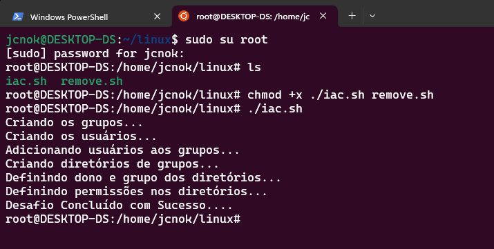
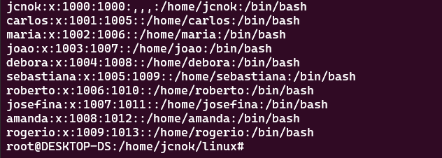
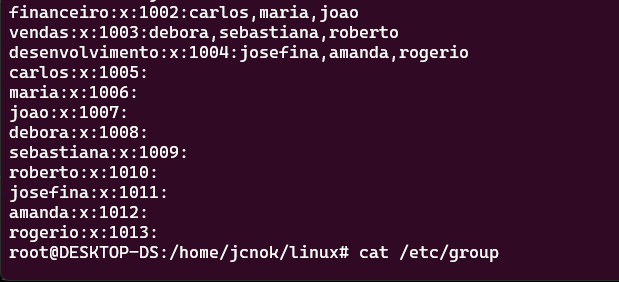
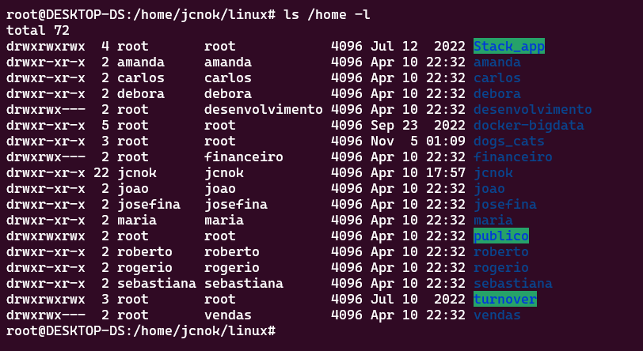
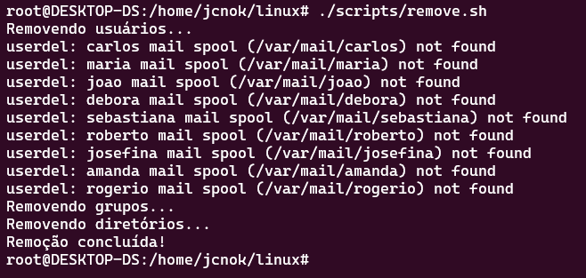

# Bootcamp-Cloud-AWS-DIO

## Desafio de Infraestrutura como Código (IaC)

Este é um projeto de automação de infraestrutura com shell script, onde iremos criar um script que será responsável por criar usuários, grupos de usuários, diretórios e definir permissões de acesso. Todo o processo será automatizado, o que vai facilitar bastante o gerenciamento de uma nova máquina virtual.

## Descrição do Projeto

O objetivo deste projeto é automatizar o processo de criação de usuários, grupos de usuários e diretórios em um sistema operacional Linux. Para isso, iremos utilizar dois arquivos shell script: iac.sh e remove.sh. O primeiro arquivo será responsável por criar usuários, grupos, diretórios e definir as permissões de acesso, enquanto o segundo arquivo será responsável por remover todos os procedimentos realizados.

## Documentação do código referente ao script iac.sh:

Na primeira parte do código, são criados três grupos: financeiro, vendas e desenvolvimento. Em seguida, são criados 9 usuários, sendo que 3 são adicionados ao grupo financeiro, 3 ao grupo vendas e 3 ao grupo desenvolvimento. Para criar os usuários, é utilizado o comando "useradd", que permite a criação de novos usuários no sistema. É importante destacar que cada usuário criado recebe uma senha criptografada gerada pelo comando "openssl passwd -crypt", que recebe como parâmetro a senha em texto claro.

Após a criação dos usuários, é feita a adição dos usuários aos grupos correspondentes, utilizando o comando "usermod". Em seguida, são criados diretórios para cada grupo, utilizando o comando "mkdir", e definidos os proprietários dos diretórios, utilizando o comando "chown". Por fim, são definidas as permissões de acesso aos diretórios, utilizando o comando "chmod". O diretório "publico" recebe permissão total de acesso para todos os usuários.

## Documentação do código referente ao script remove.sh:

Esse código é responsável por remover os usuários, grupos e diretórios criados pelo código anterior. Para isso, ele utiliza os comandos userdel para remover os usuários, groupdel para remover os grupos e rm -Rf para remover os diretórios de forma recursiva e forçada.

Ao executar o script, o usuário será informado que os usuários, grupos e diretórios serão removidos e, em seguida, todo o processo será realizado automaticamente.

## Como executar o script:

1. Faça o clone desse repositófio -  root@DESKTOP-DS:/home/clone# _git clone https://github.com/Jcnok/Bootcamp-Cloud-AWS-DIO.git_
2. Navegue até a pasta scripts e dê a permissão de execução com comando - root@DESKTOP-DS:/home/clone/Bootcamp-Cloud-AWS-DIO/scripts# _chmod +x ./iac.sh remove.sh_
3. execute o arquivo: _./iac.sh_

4. Conferindo os usuários criados:  _cat /etc/passwd_

5. Conferindo os Grupos criados:  _cat /etc/group_

6. Conferindo os Diretórios criados:_ls /home -l_

7. Por fim, usando o script remove.sh para remover tudo o que foi realizado:_./remove.sh_

