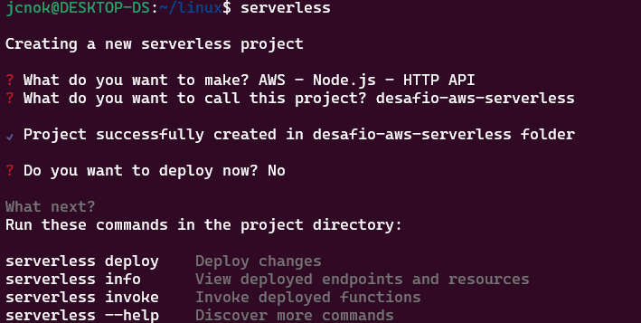
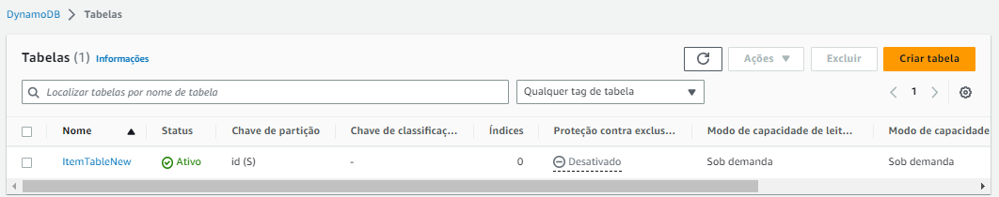
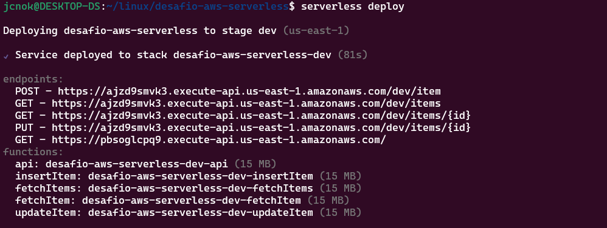
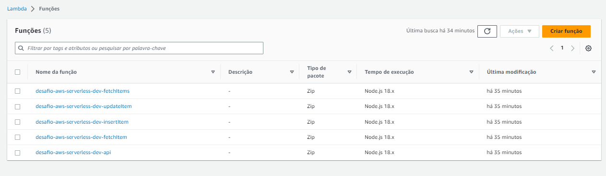
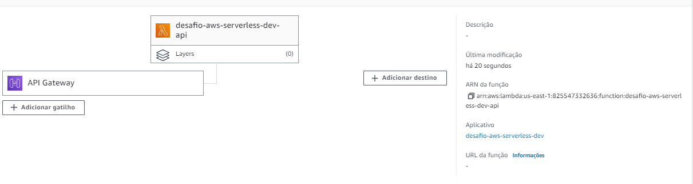
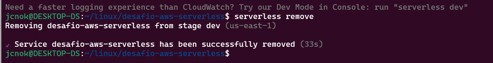

# Desafio de Projeto: Infraestrutura em Nuvem AWS com Serverless

## Sobre:

Este projeto tem como objetivo criar uma infraestrutura em nuvem na AWS utilizando o framework Serverless e práticas de Infraestrutura as a Code. Serão utilizados serviços como API Gateway, DynamoDB e AWS Lambda.

## Tecnologias utilizadas

* [AWS](https://aws.amazon.com/pt/): plataforma de serviços de computação em nuvem oferecida pela Amazon Web Services.
* [Serverless Framework](https://www.serverless.com/): estrutura para construção de aplicativos sem servidor (serverless) com suporte a várias nuvens, incluindo AWS.
* [API Gateway](https://aws.amazon.com/api-gateway/): serviço que permite a criação, publicação, manutenção, monitoramento e proteção de APIs.
* [DynamoDB](https://aws.amazon.com/dynamodb/): serviço de banco de dados NoSQL escalável e de alto desempenho da AWS.
* [AWS Lambda](https://aws.amazon.com/lambda/): serviço de computação sem servidor que executa o código em resposta a eventos e automaticamente gerencia os recursos de computação.

## Funcionalidades

* Criação de infraestrutura na nuvem AWS com Serverless Framework e práticas de Infraestrutura as a Code.
* Utilização de API Gateway para gerenciamento e publicação de APIs.
* Uso do DynamoDB como banco de dados NoSQL para armazenamento e recuperação de dados.
* Implementação de funções Lambda para processamento de eventos e resposta a chamadas de APIs.

## Como utilizar

Pré requisitos: 
 - possuir uma conta na AWS e instalar Node.js na máquina.
 - Instalar o [AWS CLI](https://docs.aws.amazon.com/cli/latest/userguide/cli-chap-welcome.html)

### Setup Inicial

#### Credenciais AWS

- Criar usuário: AWS Management Console -> IAM Dashboard -> Create New User -> <nome do usuário> -> Permissions "Administrator Access" -> Programmatic Access -> Dowload Keys
- No terminal: ```$ aws configure``` -> colar as credenciais geradas anteriormente
 
#### Configurar o framework Serverless
```$ npm i -g serverless```

### Desenvolvimento do projeto
 
```
$ serverless
Login/Register: No
Update: No
Type: Node.js HTTP API
Name: desafio-aws-serverless
```


```
$ cd desafio-aws-serverless
$ code .
``` 
- No arquivo ```serverless.yml``` adicionar a região ```region: us-east-1``` dentro do escopo de ```provider:```
- Salvar e realizar o deploy ```$ serverless deploy -v```

#### Estruturar o código

- Criar o diretório "src" e mover o arquivo "handler.js" para dentro dele.

- Atualizar o arquivo "serverless.yml "
```
handler: src/handler.handler
```
```$ serverless deploy -v ```

#### DynamoDB
Atualizar o arquivo serverless.yml
```
resources:
  Resources:
    ItemTable:
      Type: AWS::DynamoDB::Table
      Properties:
          TableName: ItemTable
          BillingMode: PAY_PER_REQUEST
          AttributeDefinitions:
            - AttributeName: id
              AttributeType: S
          KeySchema:
            - AttributeName: id
              KeyType: HASH
```



#### Desenvolver funções lambda

	- Pasta /src do repositório
 	- Obter arn da tabela no DynamoDB AWS Console -> DynamoDB -> Overview -> Amazon Resource Name (ARN)
	- Atualizar arquivo serverless.yml com o código a seguir, abaixo do ```region:```
  ```
	iam:
      role:
          statements:
            - Effect: Allow
              Action:
                - dynamodb:PutItem
                - dynamodb:UpdateItem
                - dynamodb:GetItem
                - dynamodb:Scan
              Resource:
                - arn:aws:dynamodb:us-east-1:825547332636:table/ItemTableNew
  ```
  
   - Instalar dependências

   ```$npm init```

   ```$npm i uuid aws-sdk```
   
  - Atualizar lista de funções no arquivo serverless.yml
  ```
  functions:
  hello:
    handler: src/handler.handler
    events:
      - http:
          path: /
          method: get
  insertItem:
    handler: src/insertItem.handler
    events:
      - http:
          path: /item
          method: post
  fetchItems:
    handler: src/fetchItems.handler
    events:
      - http:
          path: /items
          method: get
  fetchItem:
    handler: src/fetchItem.handler
    events:
      - http:
          path: /items/{id}
          method: get
  updateItem:
    handler: src/updateItem.handler
    events:
      - http:
          path: /items/{id}
          method: put
  ```

- Realizar o deploy

   ```$serverless deploy```


- Conferindo as funções Lambdas criadas na AWS



## Documentação
* serverless.yml: 

  - Na seção service, é definido o nome do serviço, enquanto a seção provider define qual fornecedor de serviço será utilizado, neste caso, a Amazon Web Services (AWS). Além disso, outras configurações são definidas, como a versão do runtime do Node.js, a região e a permissão de acesso ao DynamoDB.

  - Na seção functions, são definidas as funções que serão criadas, seus respectivos handlers e os eventos que elas respondem. Neste caso, temos uma função para cada endpoint da API, que foi definida com eventos do tipo http e httpApi.

  - Por fim, na seção resources, é definido um recurso do tipo DynamoDB que será utilizado pela aplicação. O nome do recurso é ItemTableNew e suas propriedades incluem o nome da tabela, o modo de cobrança, a definição dos atributos e o esquema de chave.

* src/fecthItem.js:

  - O arquivo fetchItem.js contém o código para a função Lambda que busca um item específico na tabela DynamoDB ItemTableNew. A função é acionada quando uma solicitação HTTP GET é feita para o endpoint /items/{id}.

* src/fecthItems.js:

  - O código apresentado é um módulo Node.js que exporta uma função assíncrona chamada fetchItems, a qual recebe um objeto event como parâmetro. Essa função é utilizada para obter uma lista de itens armazenados em uma tabela do DynamoDB.
  
  - O código utiliza o método scan do DocumentClient para obter todos os itens da tabela ItemTableNew. O resultado da operação é armazenado na variável results, que é um objeto contendo um array de itens na propriedade Items.

  - Em seguida, o código retorna uma resposta HTTP com um status 200 e o corpo da resposta é um objeto JSON que representa a lista de itens obtidos da tabela.

  - Caso ocorra algum erro na operação, 
  
* src/insertItem.js:

  - Este código é uma função do AWS Lambda para inserir itens em uma tabela do DynamoDB usando o SDK do AWS em Node.js.

  - O código gera um ID único com a ajuda do pacote uuid e uma data de criação. Em seguida, é criado um objeto newItem contendo as informações necessárias para serem inseridas na tabela.

  - Em seguida, a função cria uma instância do cliente DynamoDB.DocumentClient usando o SDK do AWS e chama o método put() para inserir o novo item na tabela.

  - Se a inserção for bem-sucedida, a função retorna um objeto JSON com o novo item e um código de status 200. Caso contrário, a função retorna um erro.

* src/updateItem.js:

  - Este código contém a função "updateItem" que atualiza o status de um item na tabela "ItemTableNew" do DynamoDB. O código utiliza a biblioteca "aws-sdk" para se comunicar com o DynamoDB e obter acesso aos serviços da AWS.

  - A função "updateItem" recebe um evento como parâmetro, que contém o "id" do item a ser atualizado e o novo "itemStatus" para ser definido. Primeiro, o código converte o objeto JSON do evento para uma variável JS com o valor de "itemStatus". Em seguida, utiliza o valor de "id" do evento para obter o item na tabela "ItemTableNew" do DynamoDB.

  - Com o item obtido, o código utiliza o método "update" do DynamoDB para atualizar o valor de "itemStatus" do item. O novo valor é definido na expressão "UpdateExpression" e a função recebe também os valores da expressão em "ExpressionAttributeValues". Por fim, a função retorna um objeto com a mensagem "Item updated" e status 200.

* src/handler.js:

  - O código exporta um módulo que possui uma função assíncrona handler, que recebe um objeto event como parâmetro e retorna uma resposta HTTP com status 200 e um corpo JSON.

  - A resposta contém uma mensagem de sucesso e o objeto event recebido como entrada. Esse código é um exemplo básico de uma função do AWS Lambda que pode ser utilizada como ponto de partida para a criação de outras funções que recebam entradas específicas e produzam respostas personalizadas.

#### Remover o projeto

- Para remover o projeto completo, basta executar o comando abaixo:

```$ serverless remove ```


#### Conclusão:

* Com base nos códigos apresentados neste projeto, podemos concluir que se trata de um projeto de infraestrutura em nuvem AWS utilizando o framework Serverless para o desenvolvimento baseado em Infraestrutura as a Code. Foram utilizados diversos serviços da AWS, tais como API Gateway, DynamoDB, Lambda e CloudFormation.

* Os códigos apresentados incluem funções para realizar operações de CRUD (Create, Read, Update, Delete) em um banco de dados DynamoDB, bem como uma função simples de "hello world" para verificar se a infraestrutura está funcionando corretamente. Cada função foi documentada de forma clara e concisa, explicando o que ela faz e como deve ser utilizada.

* Em resumo, o projeto apresentado é um exemplo prático de como criar uma infraestrutura de aplicativo em nuvem escalável e de alta disponibilidade usando os serviços da AWS e o framework Serverless. A abordagem "Infraestrutura as a Code" utilizada no projeto permite que todo o processo de criação, atualização e exclusão da infraestrutura seja realizado de forma automatizada, consistente e repetível.