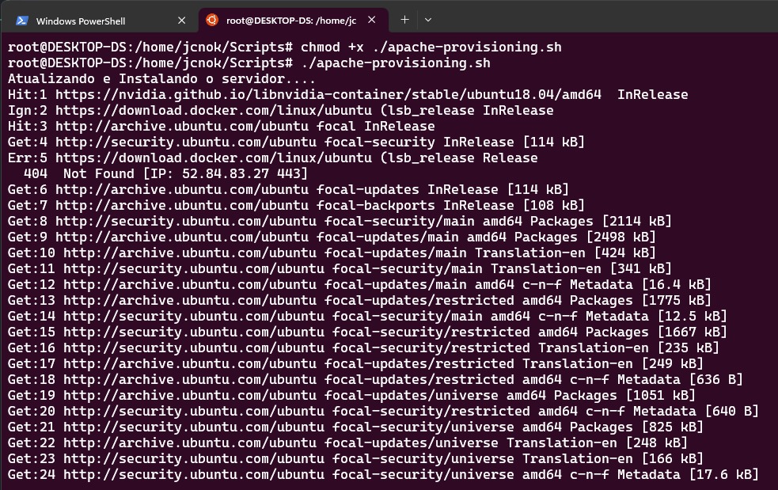
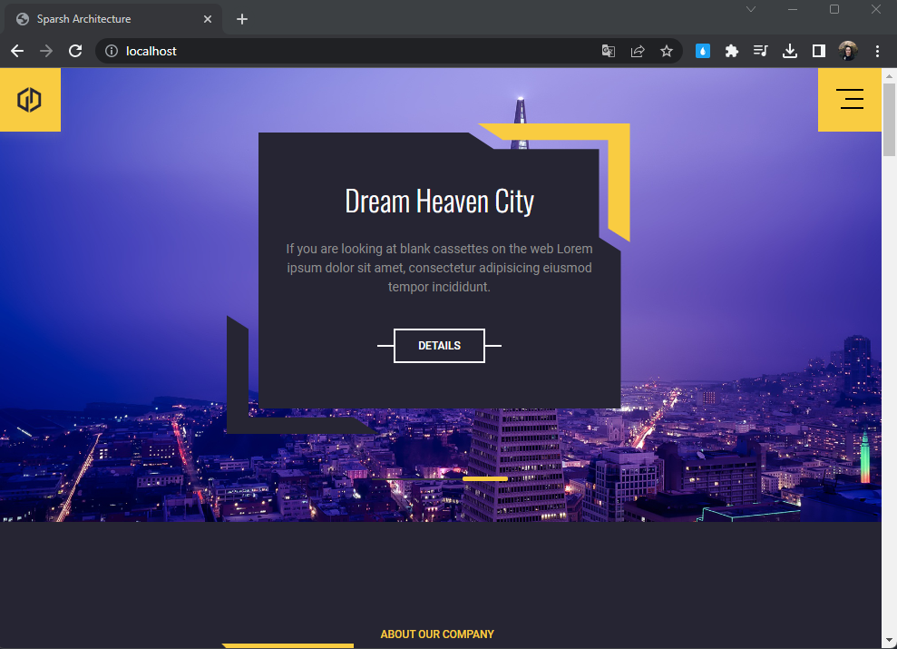

# Bootcamp-Cloud-AWS-DIO

## Desafio de Infraestrutura como Código (IaC) - Provisionamento de um servidor web (Apache)

Este é um projeto de automação de infraestrutura com shell script, onde iremos criar um script que será responsável por provisionar um servidor web (Apache). Todo o processo será automatizado, o que vai facilitar bastante o gerenciamento de uma nova máquina virtual.

## Descrição do Projeto

O objetivo deste projeto é automatizar o processo de instalação e configuração do servidor web Apache em um sistema operacional Linux. Para isso, iremos utilizar um arquivo shell script: apache-provisioning.sh. O script será responsável por atualizar o servidor, instalar o Apache, instalar o unzip, baixar a aplicação disponível em um repositório no GitHub, copiar os arquivos da aplicação para o diretório padrão do Apache.

## Documentação do código referente ao script apache-provisioning.sh:

O script começa atualizando o servidor através do comando "apt-get update" e "apt-get upgrade". Em seguida, instala o Apache e o unzip utilizando o comando "apt-get install".

Após a instalação, o script baixa a aplicação disponível em um repositório no GitHub através do comando "wget", descompacta o arquivo baixado utilizando o comando "unzip" e copia os arquivos da aplicação para o diretório padrão do Apache, utilizando o comando "cp".

Por fim ativa o servidor com "service apache2 start"

Para acessar a aplicação web, basta digitar localhost ou o endereço ip local no navegador.

## Como executar o script:

1. Faça o clone desse repositófio -  root@DESKTOP-DS:/home/clone# _git clone https://github.com/Jcnok/Bootcamp-Cloud-AWS-DIO.git_
2. Navegue até a pasta desafio_iac2/script em modo root e dê a permissão de execução com comando - root@DESKTOP-DS:/home/.../scripts# _chmod +x ./apache-provisioning.sh remove.sh_
3. execute o arquivo: _./apache-provisioning.sh_

4. Acessando a aplicação web pelo navegador: 

5. Caso desejado você pode remover e desinstalar tudo o que foi realizado com o script remove.sh: _root@DESKTOP-DS:/home/.../scripts# _./remove.sh_

## Conclusão

Com este script de provisionamento de um servidor web Apache, é possível automatizar a instalação e configuração do servidor, o que facilita bastante o gerenciamento de uma nova máquina virtual. Além disso, o script permite que os arquivos de script e da aplicação sejam facilmente atualizados e versionados em um repositório no GitHub.

[Voltar](https://github.com/Jcnok/Bootcamp-Cloud-AWS-DIO#bootcamp-cloud-aws---dio)

